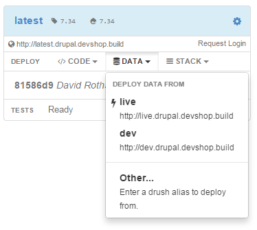
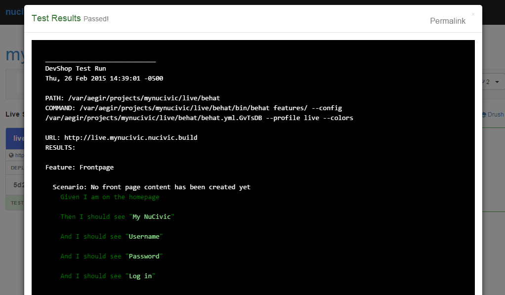

# A Call to DevOps:

## Unite!
### With DevShop

Jon Pugh

[@jonpugh](http://twitter.com/jonpugh)

http://jonpugh.github.io/devops-unite

  <strong>WARNING:</strong>
  This presentation contains sweeping generalizations and is unabashedly biased.

The Cycle of Open Source Platforms

# "Platform"

# "Platform"

> A computing platform is, in the most general sense, whatever pre-existing environment a piece of software is designed to run within, obeying its constraints, and making use of its facilities. 

http://en.wikipedia.org/wiki/Computing_platform

# "Platform"

>  A usually raised structure that has a flat surface where people or machines do work.

http://www.merriam-webster.com/dictionary/platform

# "Platform"

>  A place where people and machines do work.

this slide.

# Our Platforms

HTML

PHP

DRUPAL

  INTRODUCTION

    EXPLORATION

    COLLABORATION

    PRODUCTIZATION

    CONSENSUS

  

HTML
====

  INTRODUCTION

<small>
*http://en.wikipedia.org/wiki/List_of_content_management_systems
</small>

Out of the 111 open sourced CMS...

62 are PHP.

# php

### Consensus

# PHP

### Consensus   Introduction

# Drupal

### Consensus

# Drupal

### Consensus   Introduction

Drupal itself goes through this cycle.

# Why?

HTML  PHP  Drupal

Was PHP the best programming language?

Was Drupal the best CMS?

 <h1 class="fragment">NO.</h1>

# Why?

HTML  PHP  Drupal

  Least painful.

  Most accessible.

  Most comprehensive.

  Most opportunity.

## So where are we now?

# Drupal

Consensus

# Drupal DevOps

Introduction

# DevOps?
DevOps is everything that is needed to support a stable application and maintain productive software development.

Developers + Ops <em class='fragment'>(+ Everyone Else)</em>

### Exploration

### Exploration

### Exploration

### Exploration

# Open Process

We teach each other techniques, tools, and process.

### Collaboration

# Open Products

We build products to simplify everything for everybody.

HTML  PHP  Drupal  ? 

# DevShop

### Why
# DevShop?

### Why
# DevShop?

Keeps track of all the things:

<small>Users, servers, environments, tasks, tests, & services.</small>

Does all the things:

<small>Deploy code, deploy data, run tests, backups, commit config, logs, solr...</small>

Integrates with all the things:

<small>Drush & Drupal APIs.  Connect to Acquia, Pantheon, or any other Cloud Server Providers.</small>

### Why
# DevShop?

It is a platform to build upon.

It is a place for humans and machines to do work.

### Why not
# DevShop?

DevShop is not perfect.

DevShop is not simple.

DevShop might not do exactly what you want it to do.

but...

### Why
# DevShop?

Least painful.

Most accessible.

Most comprehensive.

Most opportunity.

# Consensus?

# Consensus?

  DevShop may not be the best platform for the job...

If something else out there is, we'd love to see it and work to improve it.

Either way, we need to collaborate, and we need consensus on a common devops platform.

# Community!
## Join Us!

Please, join the devshop community.  

Tell us what doesn't work for your. Tell us what features you think it is missing.  
 
Try to integrate your own tools and methods into devshop.

Please, PLEASE ask for help!  We want to help you!

# DevShop

### Start a project from any drupal git repo.

*Including Acquia Cloud & Pantheon repos.

### Unlimited environments from any branch or tag.

## Configurable Deploy Hooks

Each environment can have different settings.

*Drush hooks and Acquia Cloud Hooks also supported.

## Deploy Code, Data, or Stack

## Deploy Code, Data, or Stack

## Deploy Code, Data, or Stack

## Easy Drush Access

## Tasks & Logs

## Integrated Testing

 

## Easy Access to Results

## Create and Manage your cloud servers.

## Pull Request Environments

Creates when a PR is issued. Destroys when it is closed.

## So many things!

- Lock a site's database.
- Password Protect an environment.
- Automated backups.
- Domain aliases.
- Integrated Error & Commit Logs
- File Browser

It's only missing one thing...

# Community

Please help. We Need You.

Thanks!

http://drupal.org/project/devshop

http://getdevshop.com

On IRC: #devshop

<a href='http://twitter.com/opendevshop'>@opendevshop</a>
