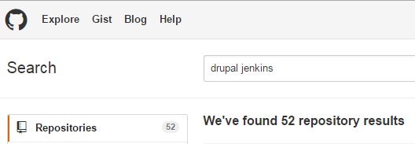

A Call to DevOps:
=================

Unite with DevShop
------------------

Jon Pugh

[@jonpugh](http://twitter.com/jonpugh)

http://jonpugh.github.io/devops-unite

  <strong>WARNING:</strong>
  This presentation contains sweeping generalizations and shameless product plugs.

The Cycle of Open Source Platforms

  INTRODUCTION

    EXPLORATION

    COLLABORATION

    CONSENSUS

  

HTML
====

  INTRODUCTION

<small>
*http://en.wikipedia.org/wiki/List_of_content_management_systems
</small>

Out of the 111 open sourced CMS...

62 are PHP.

# php

### Consensus

# PHP

### Consensus   Introduction

# Drupal

### Consensus

# Drupal

### Consensus   Introduction

Drupal itself goes through this cycle.

# Why?

HTML  PHP  Drupal

Was PHP the best programming language?

Was Drupal the best CMS?

 <h1 class="fragment">NO.</h1>

# Why?

HTML  PHP  Drupal

  They give us great power, with the least amount of pain.

  They are focused on the needs of the implementers.

  They are incredibly useful and easily accessible.

## So where are we now?

# Drupal

Consensus

# Drupal DevOps

Introduction

# DevOps?
DevOps is everything that is needed to support a stable application and maintain productive software development.

Developers + Ops <em class='fragment'>(+ Everyone Else)</em>

### Exploration

### Exploration

### Exploration

### Exploration

# Open Process

People teach each other techniques, tools, and process.

### Collaboration

# Open Products

People build products to simplify everything.

### Consensus?

<h1>Community</h1>

## Community is more important than Code.

HTML  PHP  Drupal

Community is what made these platforms what they are.

I formerly invite you to join our community.

# DevShop

### Why
# DevShop?

### Why
# DevShop?

Keeps track of all the things:

<small>Users, servers, environments, tasks, tests, & services.</small>

Does all the things:

<small>Deploy code, deploy data, run tests, backups, commit config, logs, solr...</small>

Integrates with all the things:

<small>Drush & Drupal APIs.  Connect to Acquia, Pantheon, or any other Cloud Server Providers.</small>

### Why not
# DevShop?

DevShop is not perfect.

DevShop is not simple.

But DevShop is comprehensive, useful, and open source.

# Consensus?

DevShop may not be the best platform for the job...

If something else out there is, we'd love to see it and work to improve it.

Either way, we need to collaborate, and we need consensus on a common devops platform.

